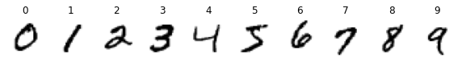
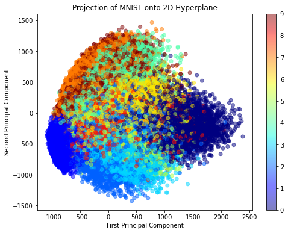
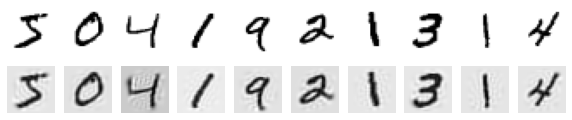
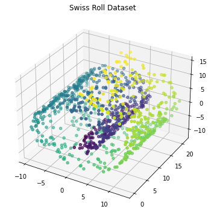
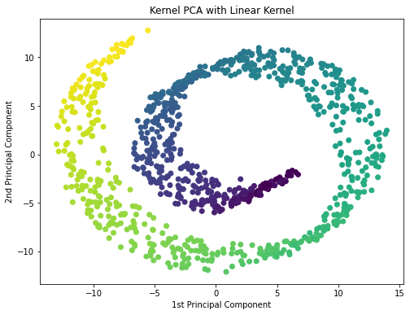
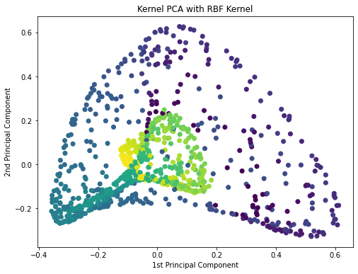
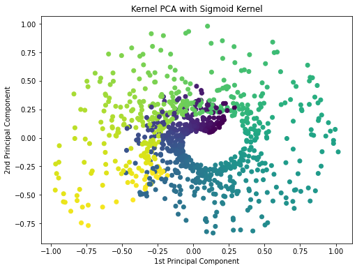
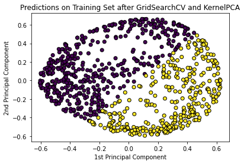

# Analysis Report

## Using Incremental PCA to reduce dimensions of the MNIST Dataset

### 1. Loading and Converting the Dataset

- **Dataset**: The dataset is in ARFF format, containing 70,000 rows and 785 columns (with the last column being the target label).
- **Data Loading**: The `arff` library is used to load the MNIST dataset, and it is converted into a Pandas DataFrame for further analysis.
- **Key Observations**:
  - The dataset contains 784 feature columns representing pixel intensities of 28x28 images.
  - The last column contains the target labels (digits from 0 to 9).

---

### 2. Displaying Unique Digits

- **Objective**: To display each unique digit from the dataset at least once using its corresponding pixel values.
- **Visualization**: The images for each digit (0-9) are shown using matplotlib, and the pixel data is reshaped from 784 values to a 28x28 matrix for visualization.



---

### 3. Principal Component Analysis (PCA)

- **Objective**: Reduce the dataset's dimensionality and retrieve the first two principal components. The explained variance ratio for these components is printed to understand how much variance is captured.
- **Key Observations**:
  - The explained variance ratio of the first two components indicates how much of the dataset's variance is preserved in this reduced 2D space.
- Explained variance ratio of the first two principal components: [0.09746116 0.07155445]'''
---

### 4. Projections onto a 2D Hyperplane

- **Objective**: Visualize the projections of the MNIST data onto a 2D hyperplane using the first two principal components.
- **Key Observations**:
  - Dimensions are reduced.
  - Some overlapping is observed.
  - Easier to identify digits form better clusters.



---

### 5. Incremental PCA for Dimensionality Reduction

- **Objective**: Perform Incremental PCA to reduce the dimensionality of the dataset to 154 components. Incremental PCA is particularly useful when working with large datasets like MNIST, as it processes the data in batches.
- **Key Observations**:
  - After applying Incremental PCA, the dataset's shape is reduced to (70,000, 154), which significantly reduces computational complexity while preserving most of the information.

---

### 6. Displaying Original and Compressed Digits

- **Objective**: Display the original and compressed versions of the digits after dimensionality reduction using Incremental PCA.
- **Key Observations**:
  - The reconstructed images have a lower pixel quality (as they are based on reduced dimensions), but they still retain most of the recognizable features of the digits.



---

## Classifying a Swiss Roll Dataset using Logistic Regression and Exploring Kernel PCA

### 1. Data Generation and Visualization

- **Objective**: A Swiss Roll dataset was generated using `make_swiss_roll` with 1000 samples. This dataset is useful for demonstrating non-linear dimensionality reduction.
- **Visualization**: The Swiss Roll is plotted in 3D, where color represents different positions along the roll.



---

### 2. Applying Kernel PCA with Different Kernels

- **Objective**: Kernel PCA (kPCA) was applied using three kernels—linear, RBF, and sigmoid—to reduce the dataset to 2D space.
  




---

### 3. Logistic Regression after Kernel PCA

- **Objective**: Logistic Regression was applied after performing Kernel PCA with the RBF kernel. The model was evaluated on training and testing datasets to check its performance.
- **Key Observations**:
  - The testing accuracy is lower compared to training accuracy, indicating potential overfitting.

---

### 4. Hyperparameter Tuning with GridSearchCV

- **Objective**: GridSearchCV was used to optimize the kernel type and gamma value for Kernel PCA by testing multiple combinations.
- **Key Observations**:
  - Best Parameters found by GridSearchCV:
    ```json
    {'kpca__gamma': 0.3593813663804626, 'kpca__kernel': 'rbf'}
    ```
  - Best cross-validation accuracy: `0.6374456741103697`
  - Training accuracy: `0.625`
  - Test accuracy: `0.61`

---

### 5. Plot the Predictions from GridSearchCV

- After running GridSearchCV and obtaining the best parameters, the predictions were plotted for the test data using the best model.



---

## Conclusion

This report demonstrates how dimensionality reduction techniques like PCA and Incremental PCA can be used on the MNIST dataset to reduce computational complexity while maintaining key features. Additionally, Kernel PCA combined with Logistic Regression is explored for classifying a non-linear dataset like the Swiss Roll, with hyperparameter tuning via GridSearchCV helping to improve model performance.
